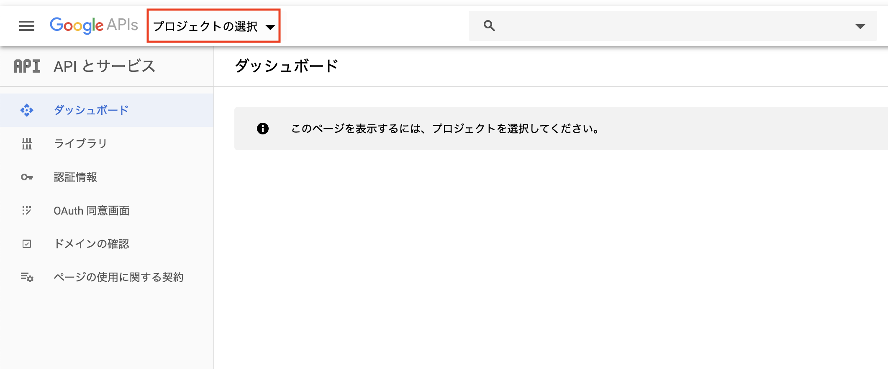
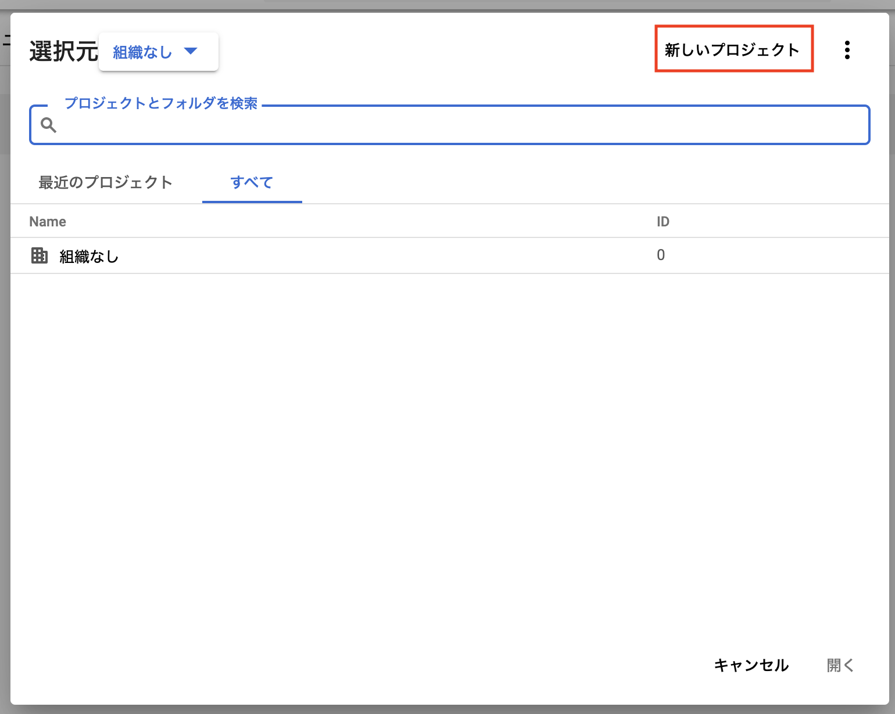
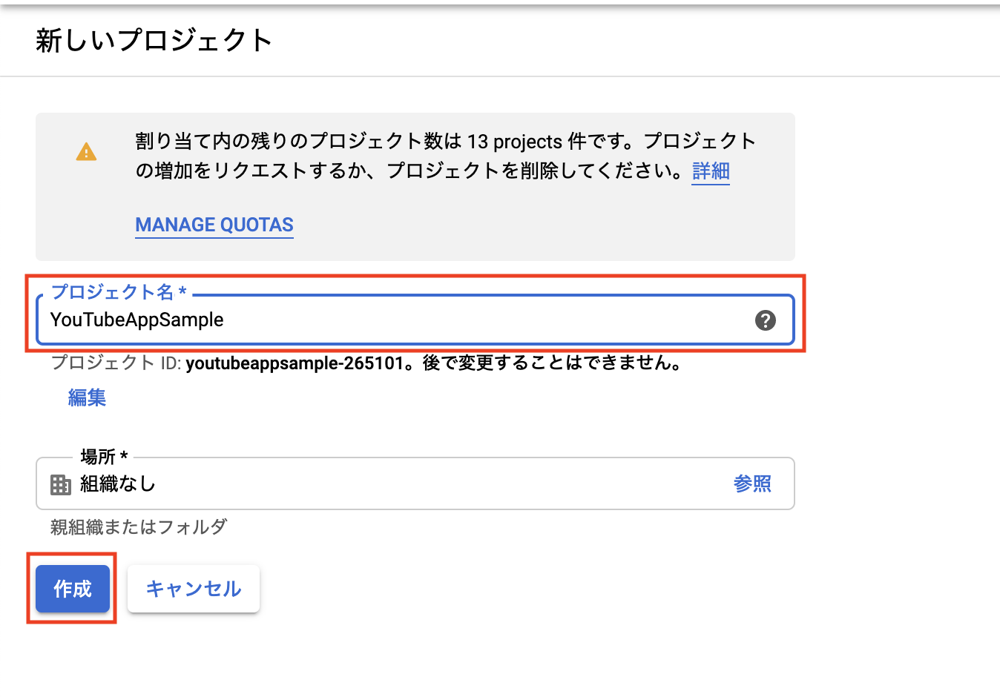
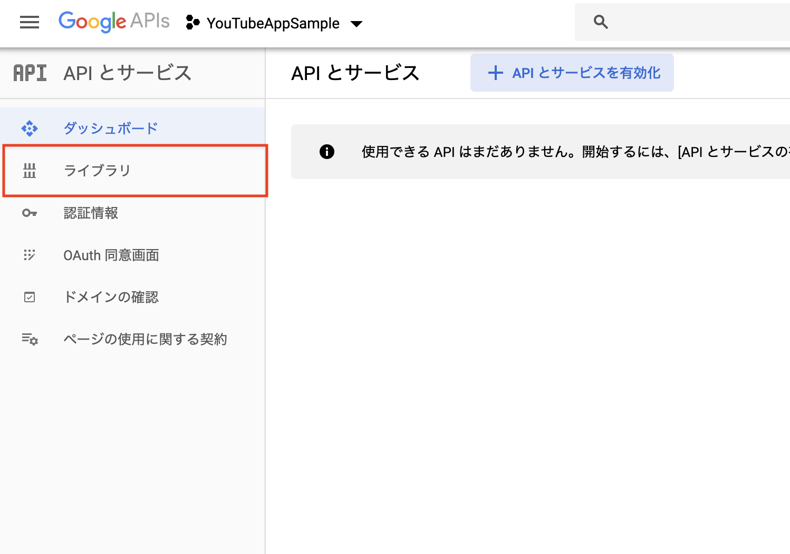
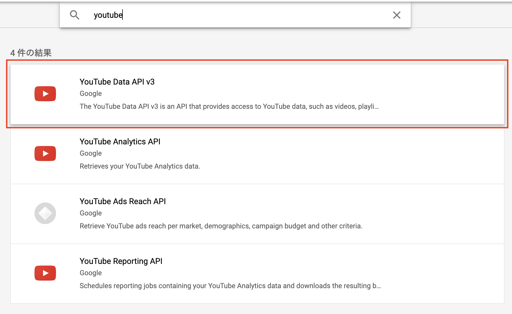
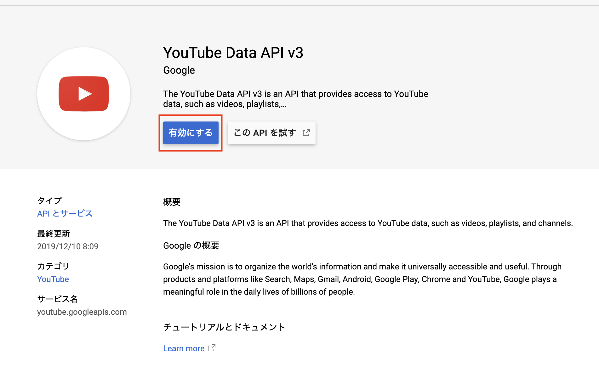
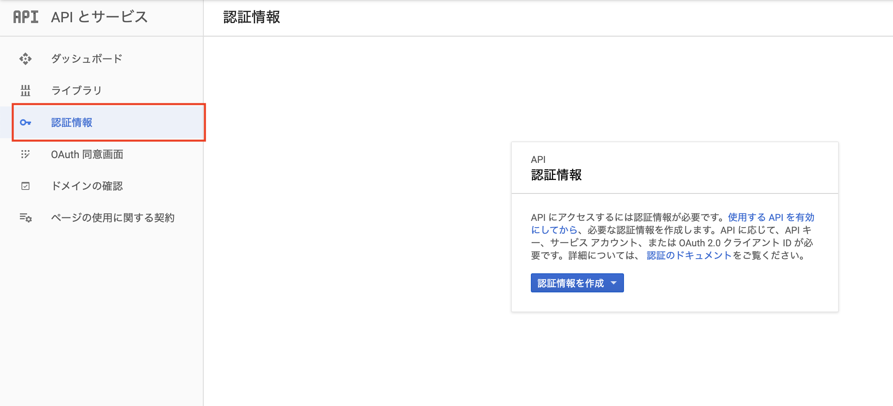
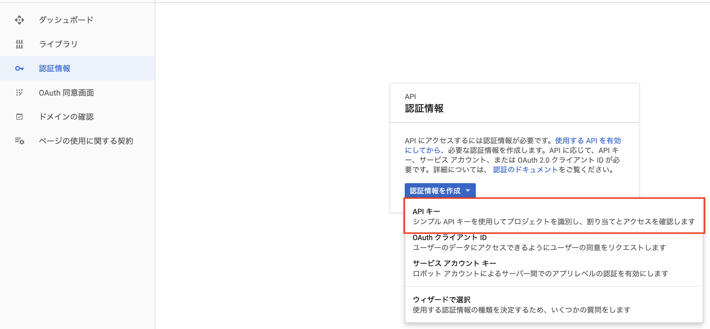
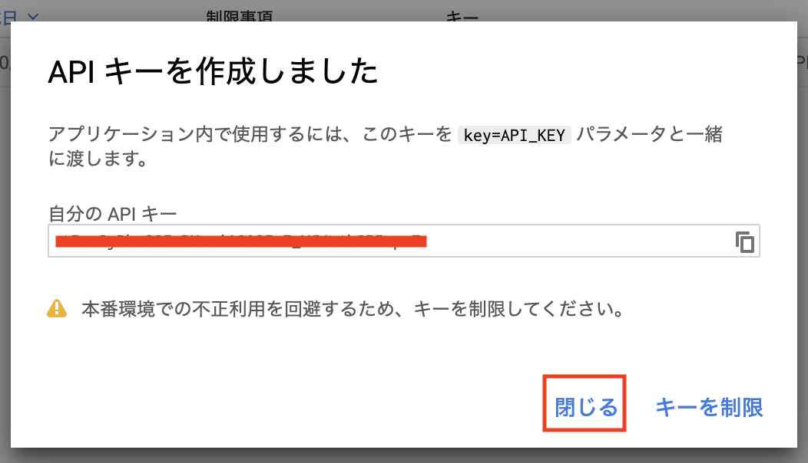
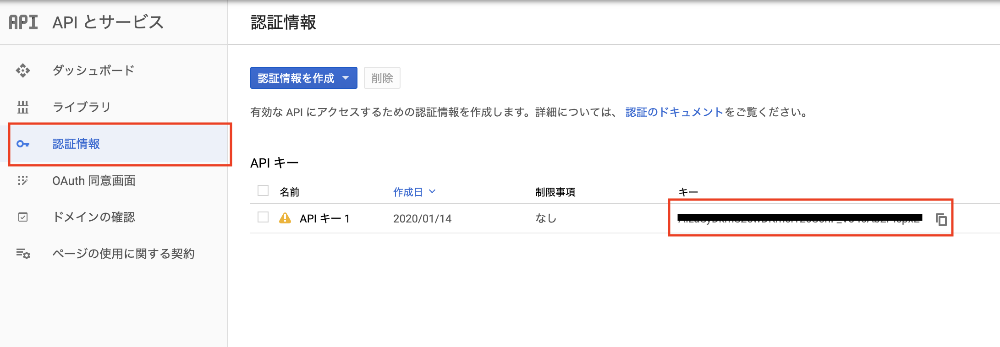

# YouTubeApi

## 手順
1. YouTubeのAPIキーを取得
2. 画面の作成
3. 


### YouTubeのAPIキーを取得
1. [Google Developers Console](https://console.developers.google.com)にアクセスする

2. プロジェクトを作成する

    - Step 1
    

    - Step 2
    

    - Step 3
    

3. YouTube APIを有効化する

    - Step1
    

    - Step2
    

    - Step3
    

    - Step4
    

    - Step5
    

    - Step6
    

### 画面の作成
  1. index.htmlに以下のコードを書く。このプロジェクトでは、jQueryとBootStrapを使用する

    ```HTML
      <!DOCTYPE html>
      <html lang="ja">
      <head>
        <meta charset="UTF-8">
        <meta name="viewport" content="width=device-width, initial-scale=1.0">
        <meta http-equiv="X-UA-Compatible" content="ie=edge">
        <title>YouTube Data API</title>
        <script src="https://ajax.googleapis.com/ajax/libs/jquery/3.4.1/jquery.min.js" defer></script>
        <script src="https://stackpath.bootstrapcdn.com/bootstrap/4.4.1/js/bootstrap.min.js" integrity="sha384-wfSDF2E50Y2D1uUdj0O3uMBJnjuUD4Ih7YwaYd1iqfktj0Uod8GCExl3Og8ifwB6" crossorigin="anonymous" defer></script>
        <script src="app.js" defer></script>
        <link rel="stylesheet" href="https://stackpath.bootstrapcdn.com/bootstrap/4.4.1/css/bootstrap.min.css" integrity="sha384-Vkoo8x4CGsO3+Hhxv8T/Q5PaXtkKtu6ug5TOeNV6gBiFeWPGFN9MuhOf23Q9Ifjh" crossorigin="anonymous">
      </head>
      <body>

      </body>
      </html>
    ```

  2. 検索結果のテンプレートの作成

    ```HTML

    <div class="row result">

      <!-- start -->
      <div class="col-sm-6">
        <a href="https://www.youtube.com/watch?v=Dx_fKPBPYUI" target="_blank">
          <div class="card">
            
            <div class="card-body">
              <h5 class="card-title">米津玄師 MV「LOSER」</h5>
              <p class="card-text">Honda「JADE」CM 5th Single「LOSER / ナンバーナイン」</p>
            </div>
          </div>
        </a>
      </div>

      <div class="col-sm-6">
        <a href="https://www.youtube.com/watch?v=Dx_fKPBPYUI" target="_blank">
          <div class="card">
            
            <div class="card-body">
              <h5 class="card-title">米津玄師 MV「LOSER」</h5>
              <p class="card-text">Honda「JADE」CM 5th Single「LOSER / ナンバーナイン」</p>
            </div>
          </div>
        </a>
      </div>

      <div class="col-sm-6">
        <a href="https://www.youtube.com/watch?v=Dx_fKPBPYUI" target="_blank">
          <div class="card">
            
            <div class="card-body">
              <h5 class="card-title">米津玄師 MV「LOSER」</h5>
              <p class="card-text">Honda「JADE」CM 5th Single「LOSER / ナンバーナイン」</p>
            </div>
          </div>
        </a>
      </div>

      <!-- end -->
    </div>

    ```

  3. app.jsに検索結果のテンプレートを作成

    ```JavaScript
    const Card = () => `
      <div class="col-sm-6">
        <a href="https://www.youtube.com/watch?v=Dx_fKPBPYUI" target="_blank">
          <div class="card">
            
            <div class="card-body">
              <h5 class="card-title">米津玄師 MV「LOSER」</h5>
              <p class="card-text">Honda「JADE」CM 5th Single「LOSER / ナンバーナイン」</p>
            </div>
          </div>
        </a>
      </div>
    `;
    ```

  4. 検索ボタンクリック時に、10件の結果を表示する

    ```JavaScript
    $('#search-btn').on('click', () => {
      $('.result').append(Card());
    });
    ```

  5. API KEYの定数を作成する

    

    ```JavaScript
    const API_KEY = 'XXX';

    const Card = () => `
      <div class="col-sm-6">
        <a href="https://www.youtube.com/watch?v=Dx_fKPBPYUI" target="_blank">
          <div class="card">
            
            <div class="card-body">
              <h5 class="card-title">米津玄師 MV「LOSER」</h5>
              <p class="card-text">Honda「JADE」CM 5th Single「LOSER / ナンバーナイン」</p>
            </div>
          </div>
        </a>
      </div>
    `;

    $('#search-btn').on('click', () => {
      $('.result').append(Card());
    });
    ```

  6. 検索ボタンクリック時に、AjaxでYouTube Data APIを実行する

    [ドキュメント](https://developers.google.com/youtube/v3/docs/search/list)

    ```JavaScript
    $('#search-btn').on('click', () => {
      const searchWord = $('#search-word').val();

      $.ajax({
        url: 'https://www.googleapis.com/youtube/v3/search',
        type: 'GET',
        data: {
          part: 'snippet',
          q: searchWord,
          key: API_KEY,
          maxResults: 50,
          type: 'video'
        }
      }).done(response => {
        console.log(response);
      }).fail(error => {
        console.log(error);
      })
    });
    ```

  7. 完成形

    ```JavaScript
    const API_KEY = 'XXX';

    const Card = ({ videoId, src, title, description }) => `
      <div class="col-sm-6">
        <a href="https://www.youtube.com/watch?v=${videoId}" target="_blank">
          <div class="card">
            
            <div class="card-body">
              <h5 class="card-title">${title}</h5>
              <p class="card-text">${description}</p>
            </div>
          </div>
        </a>
      </div>
    `;

    $('#search-btn').on('click', () => {
      const searchWord = $('#search-word').val();

      $.ajax({
        url: 'https://www.googleapis.com/youtube/v3/search',
        type: 'GET',
        data: {
          part: 'snippet',
          q: searchWord,
          key: API_KEY,
          maxResults: 50,
          type: 'video'
        }
      }).done(response => {
        $('.result').empty();

        response.items.forEach(video => {

          const videoId = video.id.videoId;
          const thumbnail = video.snippet.thumbnails.high.url;
          const title = video.snippet.title;
          const description = video.snippet.description;

          $('.result').append(Card({ videoId: videoId, src: thumbnail, title: title, description: description }));
        });

      }).fail(error => {
        console.log(error);
      })

    });


    ```